- [Versões do ebook](#versões-do-ebook)
- [Objetivo](#objetivo)
- [Quero apenas tópicos para apreender sozinho](#quero-apenas-tópicos-para-apreender-sozinho)
  - [Básico](#básico)
    - [programação](#programação)
    - [testes](#testes)
    - [api](#api)
  - [Intermediario](#intermediario)
    - [api conceitos](#api-conceitos)
    - [ferramentas para testes api](#ferramentas-para-testes-api)
    - [automação](#automação)
    - [Desenvolvimento (opcional, porem melhora o seu conhecimento se souber)](#desenvolvimento-opcional-porem-melhora-o-seu-conhecimento-se-souber)
  - [Avancado1](#avancado1)
    - [spring](#spring)
    - [desenvolvimento](#desenvolvimento)
    - [Sonar lint](#sonar-lint)
    - [frameworks](#frameworks)
    - [desenvolvimento](#desenvolvimento-1)
    - [docker](#docker)
  - [Avancado2](#avancado2)
    - [Ci / cd](#ci--cd)
- [Dicas estudo](#dicas-estudo)
- [Como configurar computador](#como-configurar-computador)
- [Desenvolvimento](#desenvolvimento-2)
  - [Json](#json)
    - [Json - O que é?](#json---o-que-é)
    - [Json - desenho](#json---desenho)
    - [Json - Importância nos testes](#json---importância-nos-testes)
    - [Json - Como gerar?](#json---como-gerar)
    - [Json - como podemos formata-lo?](#json---como-podemos-formata-lo)
  - [DTO](#dto)
    - [DTO - O que é?](#dto---o-que-é)
    - [DTO - desenho](#dto---desenho)
    - [DTO da aplicação – class ViagemDto](#dto-da-aplicação--class-viagemdto)
  - [Entity](#entity)
    - [Entity - O que é?](#entity---o-que-é)
    - [Entity - desenho](#entity---desenho)
    - [Entity da aplicação – class Viagem](#entity-da-aplicação--class-viagem)
  - [Enum](#enum)
    - [Enum - O que é?](#enum---o-que-é)
    - [Enum da aplicação - PerfilEnum](#enum-da-aplicação---perfilenum)
    - [Enum – outros exemplos de uso](#enum--outros-exemplos-de-uso)
  - [Repository](#repository)
    - [Repository - O que é?](#repository---o-que-é)
    - [Repository - desenho](#repository---desenho)
    - [Repository - porque ele estende (extends) o JpaRepository?](#repository---porque-ele-estende-extends-o-jparepository)
  - [Logs](#logs)
    - [Logs - O que é?](#logs---o-que-é)
    - [Logs - Nível de log](#logs---nível-de-log)
    - [Logs - Boas práticas](#logs---boas-práticas)
    - [log4j - nivel de log aplicacao](#log4j---nivel-de-log-aplicacao)
  - [Gerenciar dependências](#gerenciar-dependências)
    - [java](#java)
      - [Maven e Glade (Depências Maven ou Glade - Arquivo Pom)](#maven-e-glade-depências-maven-ou-glade---arquivo-pom)
      - [Maven - para projetos java](#maven---para-projetos-java)
      - [Glade](#glade)
    - [node](#node)
      - [npm / package json](#npm--package-json)
  - [Arquivos de configuração](#arquivos-de-configuração)
    - [Arquivos de configuração - .properties](#arquivos-de-configuração---properties)
    - [Arquivos de configuração - .yml](#arquivos-de-configuração---yml)
    - [Arquivos de configuração – como converter um yml para .properties](#arquivos-de-configuração--como-converter-um-yml-para-properties)
    - [Arquivos de configuração – uso no dia a dia](#arquivos-de-configuração--uso-no-dia-a-dia)
  - [Camadas de um sistema](#camadas-de-um-sistema)
  - [FrontEnd](#frontend)
  - [Backend](#backend)
    - [Spring](#spring-1)
    - [Controller](#controller)
    - [Service](#service)
    - [Repository](#repository-1)
      - [JPA](#jpa)
    - [Application](#application)
    - [Banco de Dados](#banco-de-dados)
      - [Relacional](#relacional)
      - [Não relacional](#não-relacional)
    - [Swagger](#swagger)
      - [Configurar projeto](#configurar-projeto)
      - [Exemplo - visualizar swagger](#exemplo---visualizar-swagger)
      - [Exemplo2 - alterar controller da aplicacao, visualizar swagger alterado](#exemplo2---alterar-controller-da-aplicacao-visualizar-swagger-alterado)
    - [HealCheck / Actuator](#healcheck--actuator)
      - [como configurar ele no projeto](#como-configurar-ele-no-projeto)
  - [Comunicao de sistemas](#comunicao-de-sistemas)
    - [Tipos Comunicacao](#tipos-comunicacao)
      - [Sincrono](#sincrono)
      - [Assincrono](#assincrono)
    - [Rest](#rest)
    - [Fila](#fila)
      - [Fila - Simple Queue Service (SQS)](#fila---simple-queue-service-sqs)
      - [Fila - IBM MQ](#fila---ibm-mq)
  - [Outros](#outros)
    - [Redis](#redis)
    - [Amazon Simple Storage Service (Aws S3)](#amazon-simple-storage-service-aws-s3)
    - [Amazon Simple Email Service (Aws SES)](#amazon-simple-email-service-aws-ses)
- [Conceitos de Qualidade / QA](#conceitos-de-qualidade--qa)
  - [Teste Manual](#teste-manual)
  - [Cenários de testes](#cenários-de-testes)
  - [Técnicas de Testes – Tabela de Decisão](#técnicas-de-testes--tabela-de-decisão)
  - [Técnicas de Testes – Partição de Equivalência](#técnicas-de-testes--partição-de-equivalência)
  - [Técnica POISED – testes de api](#técnica-poised--testes-de-api)
    - [aplicando tecnica](#aplicando-tecnica)
  - [Técnica VADER](#técnica-vader)
  - [Como está a cobertura da sua API?](#como-está-a-cobertura-da-sua-api)
  - [Flaky Tests](#flaky-tests)
  - [Tipos de Testes](#tipos-de-testes)
    - [Unitários](#unitários)
    - [Teste jsonschema](#teste-jsonschema)
    - [Teste contrato](#teste-contrato)
    - [Teste Integrado](#teste-integrado)
    - [Teste Sistema / e2e](#teste-sistema--e2e)
      - [Pontos estudar](#pontos-estudar)
    - [Teste Performance](#teste-performance)
    - [Teste Mobile](#teste-mobile)
  - [Frameworks](#frameworks-1)
  - [Ferramentas](#ferramentas)
    - [Postman](#postman)
    - [Swagger](#swagger-1)
  - [Topicos avancados](#topicos-avancados)
    - [Pipeline](#pipeline)
    - [Camadas de execucao dos Testes](#camadas-de-execucao-dos-testes)
    - [Importancia / Porque ter uma pipeline](#importancia--porque-ter-uma-pipeline)
  - [Análise estatica](#análise-estatica)
  - [SeleniumGrid](#seleniumgrid)
- [CONCLUSÃO](#conclusão)
- [REFERENCIAS](#referencias)
- [RECOMENDAÇÕES](#recomendações)
  - [LIVROS](#livros)
  - [CURSOS](#cursos)
  - [ARTIGOS](#artigos)
  - [Patterns para QA](#patterns-para-qa)
  - [Sites com api’s para estudo](#sites-com-apis-para-estudo)
  - [Guia estudo QA](#guia-estudo-qa)
  - [MELHORES VIDEOS E PALESTRAS](#melhores-videos-e-palestras)
- [SOBRE AUTOR](#sobre-autor)
- [Achou conteúdo importante, revelante ou apreendeu algo?](#achou-conteúdo-importante-revelante-ou-apreendeu-algo)
- [Informativo](#informativo)

# Versões do ebook

1.0.0 2023.11.22 versão final publicada

# Objetivo

Ampliar a visão de qualidade / desenvolvimento / pipeline / teste integração, testes unitários, teste contrato (e muitos outros), podendo assim entregar um trabalho de mais qualidade e ajudar o time no que for preciso. Escrevi esse documento com o intuito de repassar algumas coisas que acho relevante para conhecermos, porem pouco comentadas por QA’s

- Falta de visao, o que preciso estudar?
- Existe um minimo que um QA precise saber?
- Quais topicos que os QA precisam lidar e entender no dia a dia?

No decorrer da carreira e area fui estudando, fazendo muitos cursos, lendo livros, vendo palestras, convenando com pessoas, apreendendo com desenvolvedor / time / amigos e colegas e gostaria de compartilhar um pouquinho de coisas relevantes que precisamos saber, ou pelo menos saber que elas existem, pois em muitos momentos vamos precisar delas para nos ajudar a dar um norte do que fazer ou seguir.

# Quero apenas tópicos para apreender sozinho

## Básico

### programação

logica programação
if, else, ifelse, swith (case)
for, foreach, while, do while
enum
orientacao a objetos

### testes

teste manual
teste automatizado web e2e (selenium, cypress)
teste automatizado api (restassurance, chai, supertest, supertest, cypress, python)

### api

- Como e o funcionamento basico de uma api

basico git

- livro git: <https://git-scm.com/book/en/v2>
- link doc Paulo: <https://github.com/PauloGoncalvesBH/treinamento-git>
- video akita1 (opcional)
- video akita2 (opcional)

## Intermediario

### api conceitos

- verbos get, post, put, delete
- json, cod response, schema, type
- body, request, response, body retorno, header
- code response 200, 201, 204, 400, 401, 404, 407, 422, 500, 504

- API Testing following the Test Pyramid (Elias Nogueira, Netherlands) [EN] – Elias Nogueira: <https://youtu.be/vRl2oO7hCFY>

- teste automatizado api integrado multiplas api (restassurance), elias..

Livro Elias api - <https://leanpub.com/api-testing-postman-rest-assured-v1>

### ferramentas para testes api

- postman, insominia
- postman - workspace, header, request

Api automacao / teste integrado api

- teste automatizado java (rest assurance, assertj)
- testes – gerar massa de dados

### automação

- teste automatizado selenium (page objects)

### Desenvolvimento (opcional, porem melhora o seu conhecimento se souber)

- debug aplicacao local
- logs da aplicacao
- nivel de logs

Niveis de testes

- unitario, integração, e2e, smoke teste, cdc contract, pact, contrato jsonschema, sanity teste

<https://github.com/PauloGoncalvesBH/treinamento-teste-contrato-daniela-bruna>

## Avancado1

### spring

Spring boot, injecao dependencia, arquivo.proprierts, arquivo.yml

- spring boot
- @Autoriwed @Component, @Service

### desenvolvimento

- service
- controller
- repository
- component
- service
- spring injecao dependencia
- spring application / runner / profile

### Sonar lint

- sonar
- analise estatica
- Plugin intellij

### frameworks

- assertj
- mocks - service, controler, classes comuns, database

### desenvolvimento

- LOG: adicionando ou removendo log aplicacao local
- desenvolvimento de aplicacao
- Avancado2
- Ci / cd

### docker

- docker
- docker-compose

## Avancado2

### Ci / cd

- docker, kubernets, pipeline
- Jenkins, Gitlab, gitactions, azure devops

# Dicas estudo

- Importância de criar sua própria api – vídeo paulo
Alura Star, Qa Sênior E Deficiente Auditivo: Paulo Gonçalves: <https://youtu.be/d6Jdytw_BhI>

- Stack trabalho e estudos QA
Roadmap QA - Aguiar Dev Talks #24 -> 34 a 38minutos
<https://youtu.be/irIHzYtWl7E>

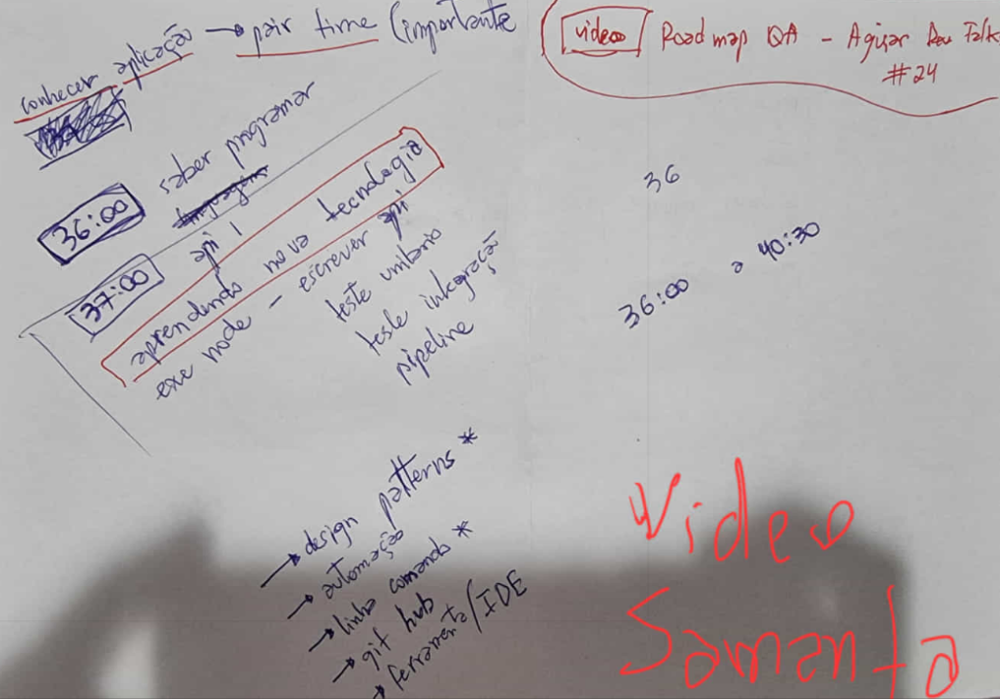

- Seja bussola e não barco – créditos julio de lima (print do instagram)


- Importância de estudar / pratico resolver problemas / experiencia / compartilhar, ensinar – julio de lima
  - O que faz um Instrutor de Testes? -> 18:00 a 24:40 minutos: <https://youtu.be/fVNHHHrf7HI>

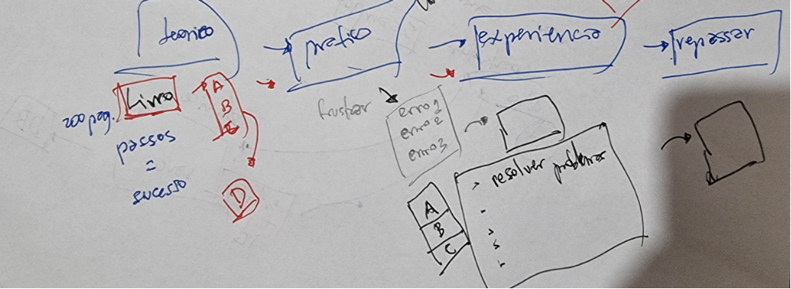

- Estudo / dicas

Olhe isso antes de sair estudando sem parar, lendo tudo e apenas seguindo tutorias certinhos ;)

# Como configurar computador

1. IDE desenvolvimento
Maven, Java, IDE: Intellij, Spring Tool Suite, Eclipse

- Java: <https://www.liquidweb.com/kb/how-to-install-java-on-ubuntu-windows-and-macos>
- Maven: <https://www.baeldung.com/install-maven-on-windows-linux-mac>
- Intellij: <https://www.jetbrains.com/idea/download> (community)
- Spring Tool Suite: <https://spring.io/tools>
- Vscode

2. Gerenciador de versao

- sdkman para usar java e maven
  - <https://sdkman.io/jdks>
  - <https://towardsdatascience.com/install-and-run-multiple-java-versions-on-linux-using-sdkman-858571bce6cf>
- Pyenv / python
  - <https://github.com/pyenv/pyenv>
- Node
  - <https://github.com/nvm-sh/nvm>
  - <https://nodejs.org/pt-br/download/package-manager/#nvm>

1. dicas [Angie Jones da TAU](https://testautomationu.applitools.com/java-programming-course/)

- Download Java OpenJDK 11 - <https://jdk.java.net/java-se-ri/11>
- Video: Install Java OpenJDK 11 on Mac - <https://www.youtube.com/watch?v=wKzYwupcaBk>
- Video: Install Java OpenJDK 11 on Windows - <https://www.youtube.com/watch?v=geJyjyDVR-A>

- IntelliJ IDEA - Community Version - <https://www.jetbrains.com/idea/download>

- Video: Install Intellij on Windows (Only need up until 3:40 mark) - <https://www.youtube.com/watch?v=8LF2_oIGiJ4>

# Desenvolvimento

Agora iremos abordar temas que normalmente sao usados por desenvolvedores porem devemos conhecer para testar aplicacoes, ou mesmo debugar coisas dos projetos, corrigir bugs, encontrar problemas, melhorias ou mesmo sair um pouco da nossa caixa / zona de conforto e poder ajudar o time no que for preciso com o tempo.

## Json

### Json - O que é?

É um texto que contém chave “{}” para delimitar o texto (inicio e fim), e dentro deles temos vários campos com chave e valor, exemplo, podemos ter o nome do campo “acompanhante” e um valor atribuído para ele de “maria”, com isso conseguimos passar vários campos, um abaixo do outro (e entre a quebra de linhas precisamos colocar virgula “,”, observe que apos a ultima linha (campo ‘regiao: norte’ não temos virgula (pois não a mais campos embaixo dele para informarmos), exemplo abaixo:

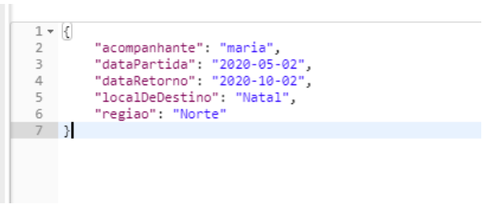

```yml
{
  "acompanhante": "maria",
  "dataPartida": "2020-05-02",
  "dataRetorno": "2020-10-02",
  "localDeDestino": "Natal",
  "regiao": "Norte"
}
```

### Json - desenho

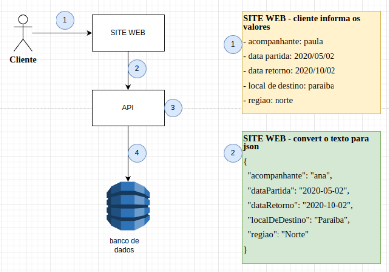

### Json - Importância nos testes

Em todas comunicações dos sistemas e aplicacoes, para que seja possivel eles se entenderem.

- sites web
- api
- chamadas e retornos de apis
- postman
- Insomnia
- fila
- E dentro outros locais de uso

### Json - Como gerar?

Para isso precisamos ir para o código um pouco para que possamos ver como é feita essa conversão de DTO ou Entity para JSON, para isso vamos usar o código fonte para dar um exemplo dessa geração. Para isso vai ser necessário adicionarmos um código no POM da biblioteca que vamos usar: JSON google, abaixo:

```xml
<!-- Escrevendo ebook - exemplo gerar JSON -->
<dependency>
	<groupId>com.google.code.gson</groupId>
	<artifactId>gson</artifactId>
	<version>2.8.6</version></dependency>
</dependency>
```

Vamos abrir uma classe (arquivo) ViagemDto e criar um método main() para setar valores e gerarmos o texto / json:

```java
//exemplo gerar o JSON
public static void main(String[] args) {
	Viagem viagem = new Viagem();      
	viagem.setAcompanhante("maria");      
	viagem.setDataPartida(new Date());      
	viagem.setDataRetorno(new Date());      
	viagem.setRegiao("Norte");      
	System.out.println("JSON exemplo {}:" + new Gson().toJson(viagem));
	//    GSON.toJson(viagem);//    Jackson.toJsonPrettyString(viagem)   
}
```

```java
System.out.println("JSON exemplo {}:" + Jackson.toJsonPrettyString(viagem));
//Ou
GSON.toJson(request);
```

Após criar o código acima vamos executar a método, basta clicar com o botão direito na classe (como na seta abaixo) e clicar em Run / Executar:

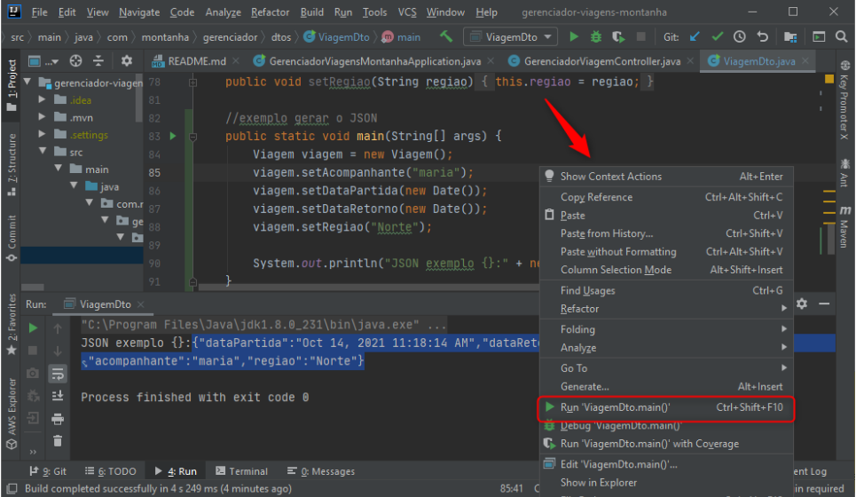

Valor gerado no console / Run, texto selecionado:

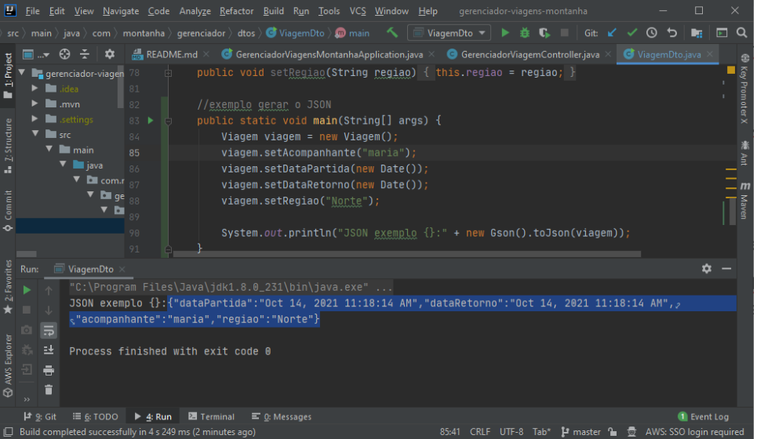

Json gerado, removi esse texto 'JSON exemplo {}:' porque era apenas comentario:

```json
{"dataPartida":"Oct 5, 2021 6:15:05 PM","dataRetorno":"Oct 5, 2021 6:15:05 PM",
"acompanhante":"maria","regiao":"Norte"}
```

### Json - como podemos formata-lo?

Ao colocar esse json acima neste site ‘https://jsoneditoronline.org/’ e clicarmos no botão que está circulado em vermelho, ele vai formatar o código ficando mais legível:

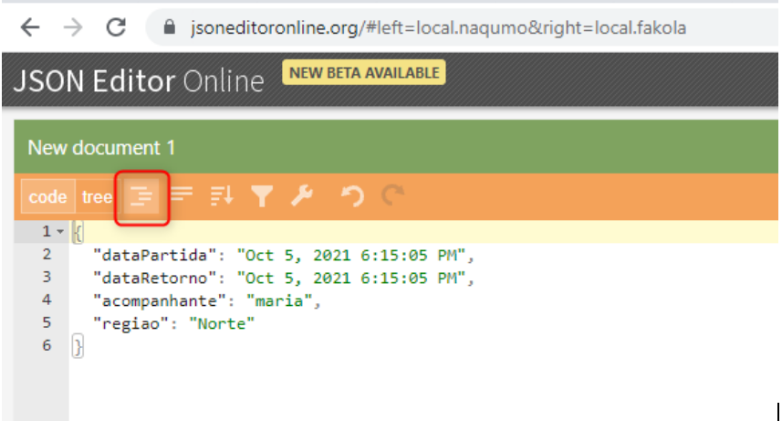

```json
{
  "dataPartida": "Oct 5, 2021 6:15:05 PM",
  "dataRetorno": "Oct 5, 2021 6:15:05 PM",
  "acompanhante": "maria",
  "regiao": "Norte"
}
```

## DTO

### DTO - O que é?

DTO é o mesmo que Data Transfer Object / Objeto de transferência de dados, comumente usado, quando um sistema recebe uma informacao / texto por json ele e convertido em seguida para um objeto (DTOViagem como exemplo) para que o sistema possa:

- Validar
- Processar informações
- Buscar informações em outros locais
- Salvar no banco de dados futuramente
- Retornar um resultado para quem chamou (sucesso, falha...)

### DTO - desenho

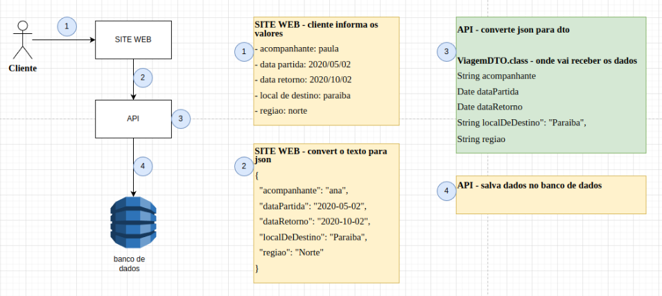

### DTO da aplicação – class ViagemDto

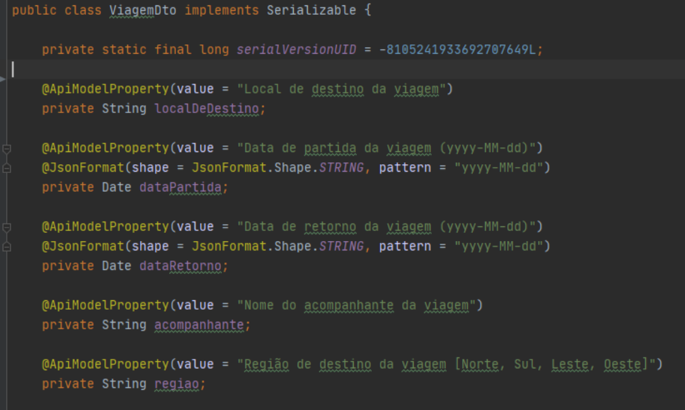

Aqui temos algumas informacoes relevantes para evitar que quem vai nos enviar nao no envie (nome de v

- Nome de campo (localDeDestino, dataPartida, dataRetorno, acompanhante, regiao)
- Tipos de campos (String, Int, int, Date, long, enum...)
- Formatacao do campo (pattern = “yyyy-MM-dd”, notNull, noEmpty)

## Entity

### Entity - O que é?

Ele é usado quando vamos salvar ou consultar algo no banco de dados, vamos pensar que ele seria a mesma linguagem do banco de dados (Dynamo, SQL, dentre outros)

Campos e tipo de dados

```java
@Id@GeneratedValue(strategy = GenerationType.AUTO)@ApiModelProperty(value = "Id da viagem")private Long id;
```

nome da tabela na parte superior (em cima com nome da classe)

```java
@Table(name = "viagem")public class Viagem implements Serializable {
```

Anotação de tabela (banco de dados)

```java
@Entity
```

### Entity - desenho

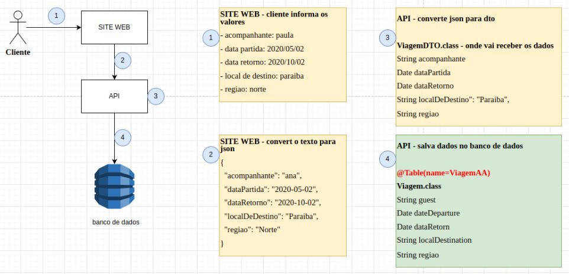

### Entity da aplicação – class Viagem

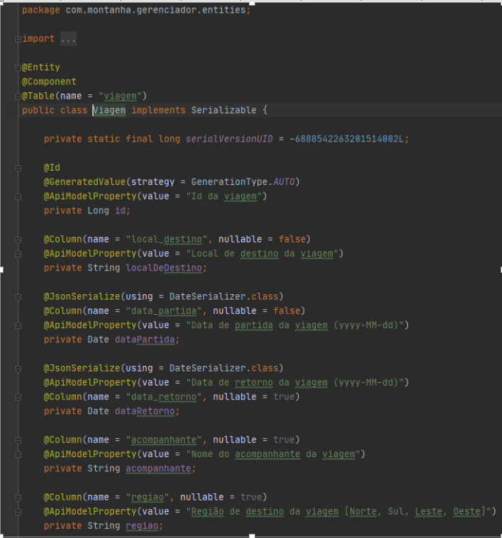

Abaixo um exemplo de entity:

## Enum

### Enum - O que é?

Enum é quando criamos um arquivo no java que nao e uma class, porem e do ENUM (public enum PerfilEnum), para armazenar valores fixos / constantes pré-definidos, nao podemos declarar uma variavel em outras classe com o nome ‘enum’ pois é palavra reservada em Java, ele nao permite tal acao. Exemplos de uso de enum: nomes de cidade, estado, países, dias da semana, meses do ano.
Comumente usado em arquivo de DTO e Entity para armazenar valores fixos (valores possíveis para um campo), caso enviarmos um valor diferente do contido no enum, o sistema ira dar erro erro, pois está em desacordo dos valores definidos no ENUM (fixo).

### Enum da aplicação - PerfilEnum

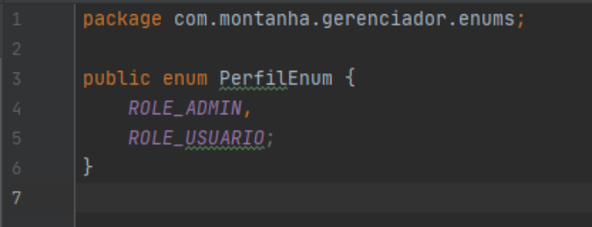

### Enum – outros exemplos de uso

Período / Turno

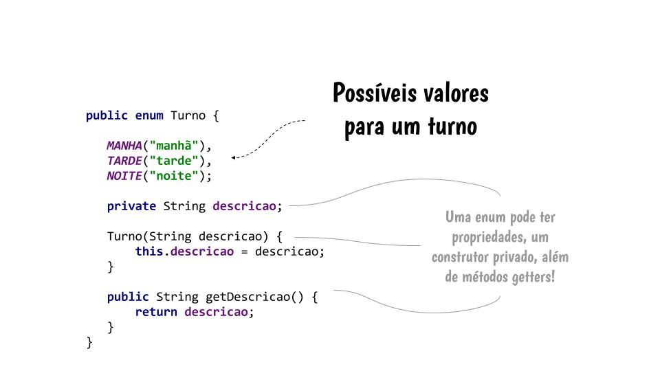
créditos da imagem / exemplo: <https://www.devmedia.com.br/enums-no-java/38764>, acessado em 05/10/2021 as 21:07

Outro exemplo é que podemos fixar um enum com lista de estados do brasil com nome e descrição:

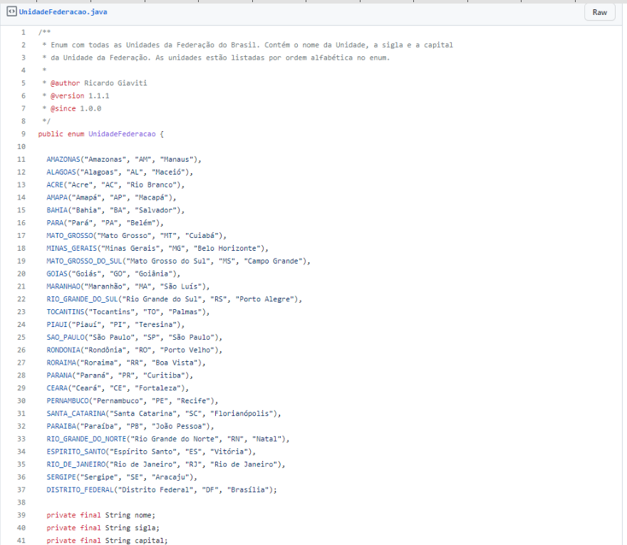

<https://gist.github.com/rgiaviti/510c260164ea25ef0449209f26560c3d>, acessado em 31/10/2021 as 18:20

## Repository

### Repository - O que é?

É uma classe que com ela conseguimos salvar, consultar, alterar ou deletar informações no banco de dados SQL de modo pratico (poucas linhas), com o uso do JPA no Java.
Onde basta instanciar essa classe, e caso esteja com as anotações corretas chamarmos o método `respository.save(entity)` ele vai salvar o conteúdo no banco de dados, caso esteja tudo correto

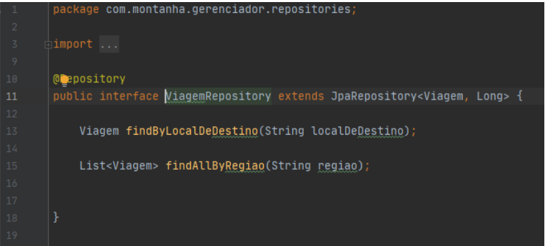

Observe que ali temos `@Repository` (anotação necessária para esse tipo de uso e o exterds com `JpaRepository<Viagem, Long>`, o nome `Viagem` ali é a entity com as anotações do banco de dados, que facilita nossa vida.

```java
public interface ViagemRepository extends JpaRepository<Viagem, Long> {
```

Obs: é possível salvarmos o objeto no banco de dados sem usar o `JpaRepository`, porém exige muito esforço e algumas classes a mais para poluir o nosso código, sendo que já existe uma biblioteca para isso criada  (mais prático e clean).

### Repository - desenho

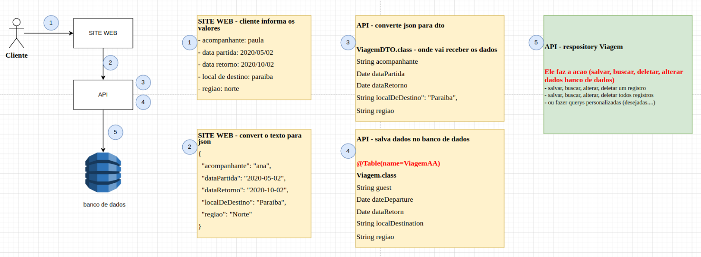

### Repository - porque ele estende (extends) o JpaRepository?

JPA e uma grande facilitador para que nos possamos salvar os dados no banco de dados, com ele conseguimos com poucas linhas poder interagir com o banco de dados. Temos muitos outros frameworks que nos possibilitam salvar dados, ou podemos salvar na mao / de forma manual, porem precisaríamos criar muitos arquivos / codigo para fazer o mesmo trabalho que o JPA/framework abstrai para nos / facilita nosso trabalho e ja tem muitas coisas por padrão / default.

## Logs

### Logs - O que é?

Muitas vezes executamos nossos testes, porém quando nos deparamos com um possível defeito ou erro 400 ou 500 na aplicação, ficamos sem saber o que realmente é, as vezes a informação retornada não é suficiente para acharmos a origem do problema real / causa.
Com isso temos que usar recursos que nos auxiliem, dee informacoes sobre o ocorrido, aqui que entra o papel dos logs da aplicação para nos ajudar a fazer o trace (rastreio do problema). O log e criado / colocado no codigo da aplicação que estamos criando, apos configurar como deveria ele comeca a mostrar algumas informações ou ocultar algumas, de acordo com o nivel de log que colocarmos na aplicação, que veremos futuramente..
Artigo que exemplifica um pouco porque devemos ver os logs, e como ele nos auxilia. QA, o código e o log também são seus: <https://medium.com/revista-dtar/qa-analisar-ou-n%C3%A3o-log-c%C3%B3digo-ao-realizar-os-testes-2dd3d2b03b0d>

### Logs - Nível de log

Temos vários níveis de log que podemos usar na aplicação / sistema, comumente vistos / usados abaixo:

- **Log INFO:** ele é mostrado no log da aplicação assim que sensibilizarmos aquele método, por exemplo quando chamamos o endoint cadastrarViagem no postman o cadastrar viagem é acionado, esse o texto é mostrado
- **Log ERROR:** exibido em casos de erro ou exceção (comportamento não esperado), como exemplo uma informação invalida na requisição
- **Log DEBUG:** usado em momentos de investigação no desenvolvimento

Vídeo que explica no detalhe em cada nível de logs, mostrar alguns outros além dos citados: Como ler logs de APIs Rest? (Aula 19): <https://www.youtube.com/watch?v=Hr1wBUUTW1Y>

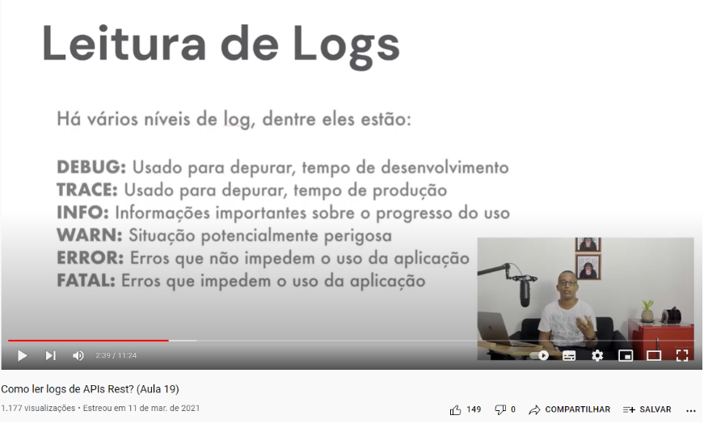

Print gerado do vídeo: <https://www.youtube.com/watch?v=Hr1wBUUTW1Y>, acessado em 14/10/2021 as 18:00

### Logs - Boas práticas

Quando criar os logs é importante nos atentar que essa informação deve estar clara e com valores condizentes para entender o que está sendo feito, para que viagem ou conta estamos efetuando o processo, bom exemplo de log: `GerenciadorViagemController - cadastrar => acompanhante: {} Maria teste Ebook` ou `GerenciarContaController - cadastrar => conta: {} 101050`, deste modo conseguimos entender de forma clara o que está sendo efetuado e rastrear a conta ou nome que está fazendo aquela ação.

Também é importante sabermos o que pode nos atrapalhar e não conseguirmos entender o que está sendo feito (muito genérico): `GerenciadorViagemController - cadastrar => acompanhante: {}` ou `GerenciarContaController - cadastrar`, imagine agora que o nosso sistema recebe 1.000 requisições de cadastro por minuto e estamos analisando um problema, e justo uma conta não foi cadastrada por algum motivo, como vamos saber que aquela conta 101099 passou por aquele ponto do código / log? Vamos ter que melhorar a geração do log para sabermos o que está acontecendo .

Vamos dar alguns exemplos abaixo de alguns logs criados na aplicação:

```java
private static final Logger log = Logger.getLogger(GerenciadorViagemController.class);
```

Exemplos de logs, para facilitar quando ver o código da aplicação:

```java
log.info("GerenciadorViagemController - cadastrar => acomplanhante: {} " + viagemDto.getAcompanhante());
```

```java
log.info("GerenciadorViagemController - cadastrar => acomplanhante: {} " + viagemDto.getAcompanhante() + ", dataPartida" + viagemDto.getDataPartida());
```

Vale salientar que os exemplos acima são apenas lúdicos para nos ambientar para acharmos eles no dia a dia, e quando vemos o log de erro, podemos abrir o código fonte em pair (par com o desenvolvedor) ou sozinhos para entender o motivo do erro encontrado. Se fizermos isso com frequência como tempo vamos no ambientando no código do desenvolvedor.

### log4j - nivel de log aplicacao

## Gerenciar dependências

### java

#### Maven e Glade (Depências Maven ou Glade - Arquivo Pom)

Ambas são usadas no momento de construção e gestão do projeto, com o uso delas podemos mitigar nosso trabalho e fazê-lo apenas uma vez.

#### Maven - para projetos java

Criado em 2004 e com ele conseguimos automatizar algumas tarefas ou rotinas, rotineiramente usado nos projetos java, por grande aceitação companhias e pessoas que desenvolvem software, ele costuma ter um arquivo xml permitindo colocarmos tags que é o arquivo comummente chamado de Modelo Objeto de Projeto POM (project objec maven). A cada compilação ele vai buscar as dependências / bibliotecas no diretório ‘M2’ da máquina, caso não encontro vai baixar da internet e armazenar neste diretório. Essa é a estrutura básica do arquivo:

```xml
<dependency>
    <groupId>org.projectlombok</groupId>    
    <artifactId>lombok</artifactId>    
    <version>1.18.22</version>
<scope>provided</scope>
</dependency>
```

Dentro do pacote `<dependency>` temos nossas dependências que sempre costumam ter:

- **groupId**
- **artifactId**
- **Version**
- **Scope**
  - **compile**: usado quando vamos buildar ou rodar o projeto
  - **provided**:
  - **runtime**: só usada ao testar ou executar
  - **Test**: não há necessidade de compilar o projeto, exemplo executar teste junit
  - **System**: similar ao ‘provided’, porém necessitamos apontar um arquivo .jar  para usa-lá

1. Usar ou não maven ou glade (exemplo abaixo):

- **Cenário 1** - projeto sem Glade, Maven: crio projeto e adiciono 10 dependências bibliotecas (arquivos .jar), neste exemplo o projeto ficou com 200mb (devido ao tamanho da librarys) e mais os 30kb de codigo da aplicação, totalizando 200mb mais alguns kb (ficando ruim para subir para o git ou enviar para um amigo / colega de trabalho).

- **Cenário 2** (usando Maven): crio projeto e adiciono todas dependências no arquivo POM  (em forma de texto, projeto fica com um total de 30kb no total, e quando for subir para o git a outra pessoa que baixar vai ter um projeto pequeno e ao importa-lo já vai começar a baixar todas dependências necessárias.

Arquivo de exemplo abaixo:

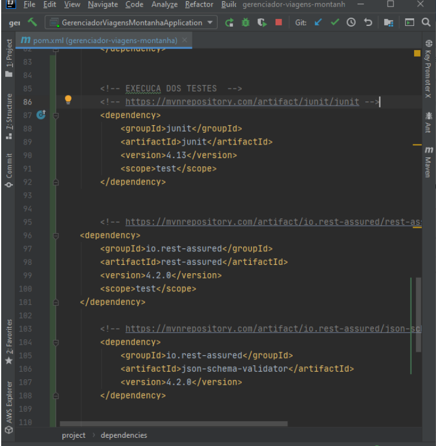

2. Caso queira saber mais, de uma olhada nos sites:

<https://www.baeldung.com/maven-dependency-scopes>
<https://howtodoinjava.com/maven/maven-dependency-scopes/>
Além de nos ajudar a organizar os projetos, nos ajudam a encontrar problemas e erros com o uso do build do projeto

#### Glade

### node

#### npm / package json

<https://www.digitalocean.com/community/tutorials/how-to-use-node-js-modules-with-npm-and-package-json-pt>
<https://medium.com/geekculture/understanding-package-json-and-package-lock-json-in-nodejs-eb04cd43d379>

<https://www.luiztools.com.br/post/o-guia-completo-do-package-json-do-node-js/>

## Arquivos de configuração

### Arquivos de configuração - .properties

Esse arquivo é um centralizador, onde podemos colocar:

- url de aplicações
- Variáveis de configuração(banco de dados, porta, ...)
- valores de configurações de bibliotecas

Quando necessitarmos mudar algum parâmetro fica fácil acharmos e alterá-lo.

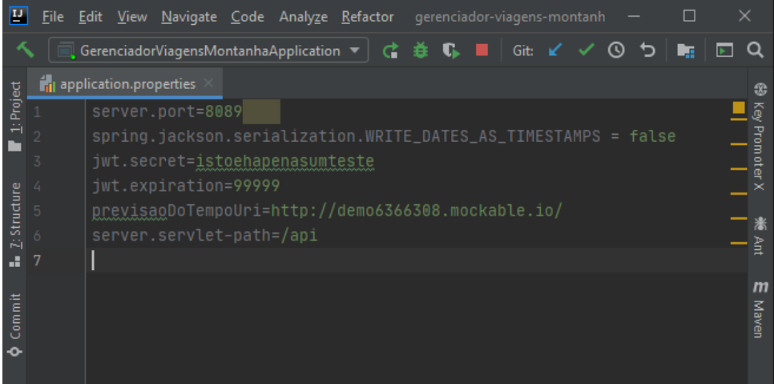

### Arquivos de configuração - .yml

//TODO

### Arquivos de configuração – como converter um yml para .properties

//TODO

### Arquivos de configuração – uso no dia a dia

1. Arquivo aplicacao

- application-local
- application-dev
- application-hml
- application-pdr

1. Arquivo testes

- application-integration
- application-test (seria para o teste unitário)

## Camadas de um sistema

1. Conceito - Visão geral
Um sistema é formado de várias camadas, esse desenho abaixo é o que costumamos ver n dia a dia (mínimo de uma aplicação):

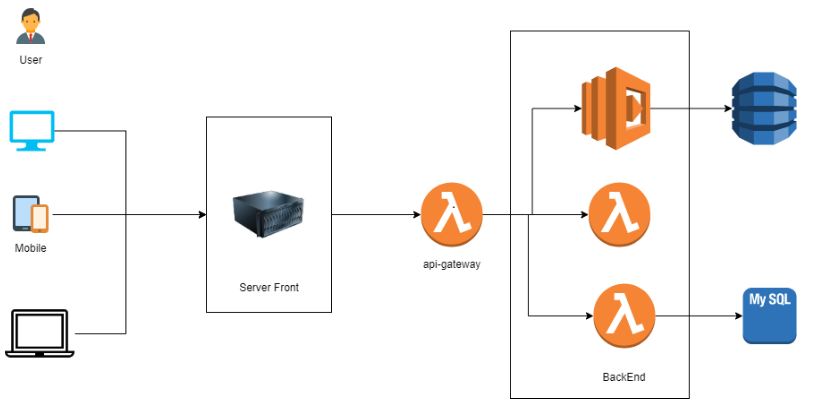

- Usuário final
Celular
Notebook
computador
- Frontend:
- Api-Gateway: que costuma fazer as rotas / segurança
- Backend: código fonte do sistema legado, podendo ter: micro serviço, lambda, entre outros.

## FrontEnd

## Backend

Quando vamos para o backend da aplicação temos algumas camadas (código da aplicação / desenvolvedor), porém para facilitar a explicação / entendimento, vamos nos ambientar com algo que estamos bem acostumados no dia a dia; a pizza tem várias camadas que se olharmos para a parte superior dela (queijo), para termos acesso as demais abaixo (queijo, carne) temos que falar com a camada abaixo, ou remove-la para visualizarmos as mesas.


//TODO, imagem com referência link

Um sistema funciona de forma similar: usuário usa o postman para enviar uma requisição, informa:

- Metodo: POST
- Informa login, senha
- Informa url da aplicacao
- Clica em enviar

Sistema que é responsável por essa URL:

- Recebe informação
- Valida dados recebidos
- Retorna
  - 200 OK (sucesso), nesse caso ele retorna o token do usuário
  - 401 Unauthorized (falha)
  - 500 Error servidor

Para que o sistema seja capaz de fazer todas essas validações, processamentos é necessário termos várias camadas onde cada uma é responsável por um item. Abaixo temos um desenho básico se analisarmos o código de backend de uma api, as camadas existentes:

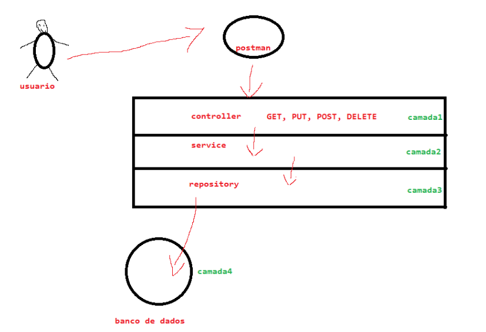

Passos:

- Usuário
- Postman é preenchido e clica em enviar e preenche os campos necessários e tipo de verbo (POST agora para fazer o login)
- Sistema faz validações / buscas / processamento
  - Controller: recebe informação, valida idioma falado (alguns campos)
  - Service: faz uma chamada ao
  - Repository busca a informação
  - Banco de dados
- Sistema retorna o resultado ao usuário

Todo processo comentado acima é feito em milésimos de segundos, como no exemplo em questão, nos próximos tópicos vamos falar um pouco quais são as camadas e o que cada uma costuma fazer, que é importante para nos atentar quando formos analisar o código ou investigar um possível problema.

### Spring

1. Exemplo básico de anotações:

- @Component
- @service
- RestController
- @Valid
- @Autowired
- @Configuration
- @Bean
- @RequestMapping
- @Repository
- @SpringBootConfiguration

explicacoes: <https://www.javatpoint.com/spring-boot-annotations>

### Controller

Usado em projetos de api rest, nele costumamos ter as chamadas iniciais dos vermos usados em rest: GET, POST, PUT, DELETE; abaixo um print da aplicação:

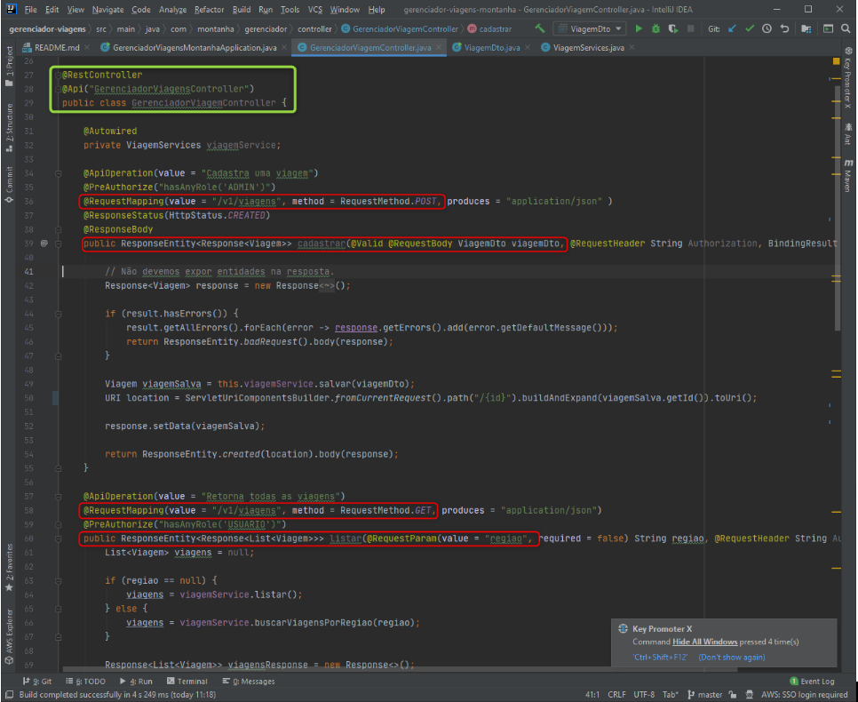

As linhas abaixo são configurações para funcionamento do rest ‘@RestController’ e nome da classe ‘GerenciadorViagemController’:

```java
@RestController@Api("GerenciadorViagensController")public class GerenciadorViagemController {
```

Aqui temos o verbo de chamadas POST para cadastro de viagem:

```java
@RequestMapping(value = "/v1/viagens", method = RequestMethod.POST= "application/json" )
	public ResponseEntity<Response<Viagem>> cadastrar(@Valid @RequestBody ViagemDto viagemDto,
```

Verbo GET para consulta viagem por regiao:

```java
@RequestMapping(value = "/v1/viagens", method = RequestMethod.GET, produces = "application/json")
	public ResponseEntity<Response<List<Viagem>>> listar(@RequestParam(value = "regiao",
```

Verbo GET para consulta viagem por id:

```java
@RequestMapping(value = "/v1/viagens/{id}", method = RequestMethod.GET, produces = "application/json")
	public ResponseEntity<Response<ViagemDtoResponse>> buscar(@PathVariable("id") Long id 
```

Verbo DELETE para deletar uma viagem informando o Id

```java
@RequestMapping(value = "/v1/viagens/{id}", method = RequestMethod.DELETE, produces = "application/json")@ResponseStatus(value = HttpStatus.NO_CONTENT)
	public void delete(@PathVariable("id") Long id
```

Verbo PUT para alterar uma viagem já cadastrada (previamente)
```java
@RequestMapping(value = "/v1/viagens/{id}", method = RequestMethod.PUT, produces = "application/json")
	public ResponseEntity<Response<Viagem>> alterar(@PathVariable("id") Long id,@Valid @RequestBody ViagemDto viagemDto   
```

Claro que existem muito mais detalhes e coisas que ele valida, porém não quero ficar entrando no detalhe, apenas saber que eles existem como:

- Validação json: contrato valido
- Parametros obrigatórios para cada tipo de método como:
  - Content-Type = application/json
  - Autorization: token

Dentro outras validações e processamentos...

### Service
Nesse caso apenas ele terá comunicação outros sistemas, faz a chamada para o repository que irá fazer a ponte (comunicação com o banco de dados), fara as buscas, cadastro viagem e terá a comunicação com o banco de dados (repositor que falaremos mais dele em outros tópicos).

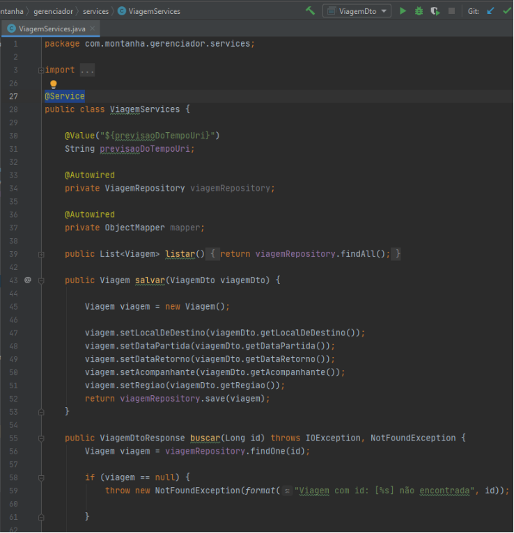

### Repository

Ele facilita muito nosso trabalho de comunicação com o banco de dados usando o JPA, até podemos fazer sem ele porém o trabalho é altíssimo (não devemos ficar criando duas ou três classes extras desnecessárias no nosso código, se tem uma biblioteca que faz isso com apenas algumas linhas e de forma simples).

#### JPA

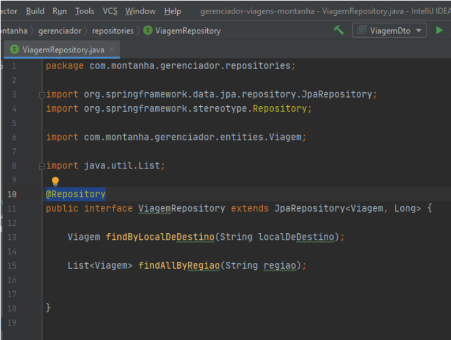

### Application

Ele costuma ser usado para subirmos a aplicação local, no caso de projetos (micro serviços), lambdas não dá para subir deste modo

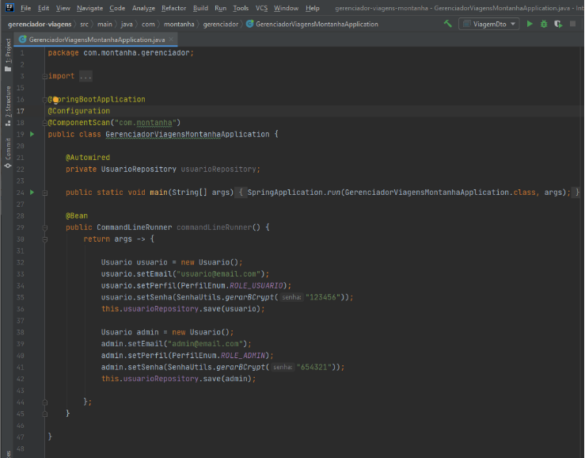

Subindo local, clica com o botão direto na classe e clica em “Run”

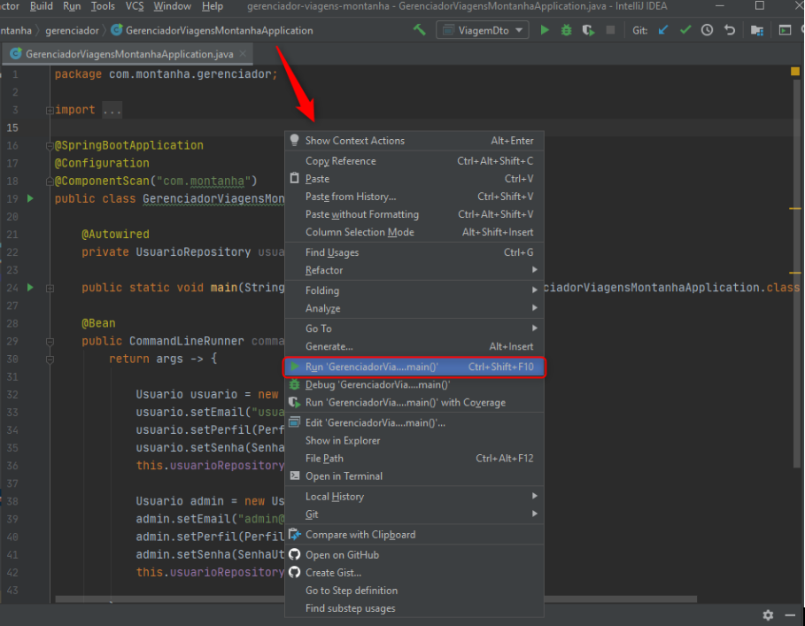

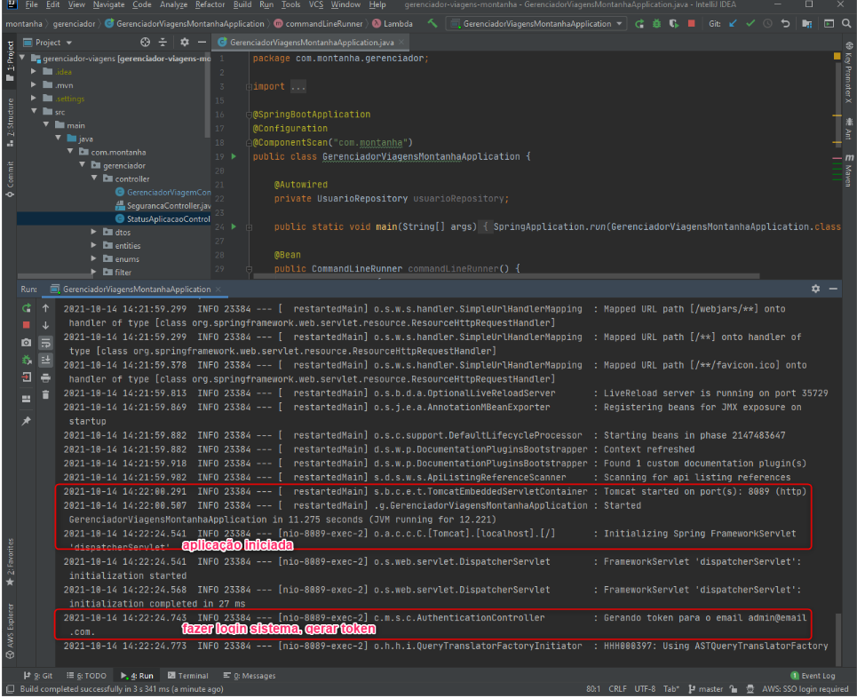

Observação: para subir micro serviços dentro da nossa empresa não é tão fácil, pois necessitamos mexer algumas coisas para que ele funcione de modo adequado (temos várias propriedade que são usadas como: ambiente, configuração banco de dados, sqs, redis, dynamo..., para isso precisamos mexer nos arquivos: `application.properties`, `bootstrap.yml` e dentre outros, vai muito da empresa / contexto. Vale a pena conversar com o desenvolvedor para lhe ajudar (se necessário).

### Banco de Dados

#### Relacional

É o banco de dados mais comum que temos no mercado, basicamente ele separara uma informação em várias tabelas, se temo as informações abaixo:
Pessoa: Nome pessoa, idade, cpf
Endereço: rua, numero, complemente, estado, cidade, cep
Compra: pedido, descricaoItem, quantidade, valor
No caso acima teríamos que ter no mínimo 4 tabelas ou mais:

- Pessoa
- Endereço
- Pedido
- Produto

Fora outras tabelas que não imaginamos ou pensamos, e a interligação / relacionamento entre elas.

Bancos comumente usados no mercado:

- SQL Server
- Mysql
- PostgreSQL
- H2

#### Não relacional

Eles costumam guardar os dados em um único texto (json) que é formado por chave e valor. Abaixo um exemplo:

```json
{
    "acompanhante": "maria",
    "dataPartida": "2020-05-02",
    "dataRetorno": "2020-10-02",
    "localDeDestino": "Natal",
    "regiao": "Norte"
}
```

Bancos comumente usados no mercado:

- Amazon DynamoDB
- MongoDB
- Redis
- Cassandra

### Swagger

#### Configurar projeto

1. dependencia maven

```xml
    <properties>
        <openapi.version>1.6.8</openapi.version>
    </properties>

	<dependencies>
		<dependency>
			<groupId>org.springdoc</groupId>
			<artifactId>springdoc-openapi-ui</artifactId>
			<version>${openapi.version}</version>
		</dependency>
    </dependencies>
```

2. arquivo de configuração

```java
package br.com.diego.libraryapi.config;

import io.swagger.v3.oas.models.OpenAPI;
import io.swagger.v3.oas.models.info.Info;
import io.swagger.v3.oas.models.info.License;
import org.springframework.beans.factory.annotation.Value;
import org.springframework.context.annotation.Bean;

public class openApiConfig {

    @Bean
    public OpenAPI customOpenAPI(@Value("${application-description}") String appDesciption, @Value("${application-version}") String appVersion) {
        return new OpenAPI()
                .info(new Info()
                        .title("Book application API")
                        .version(appVersion)
                        .description(appDesciption)
                        .termsOfService("http://swagger.io/terms/")
                        .license(new License().name("Apache 2.0").url("http://springdoc.org")));
    }

}
```

#### Exemplo - visualizar swagger

1. validar porta da aplicacao
application.properties ou application.yml

```yml
server.port=8089
```

2. subindo aplicacao
LibraryApiApplication - run
  ou
subir via terminal

4. acessar arquivo swagger
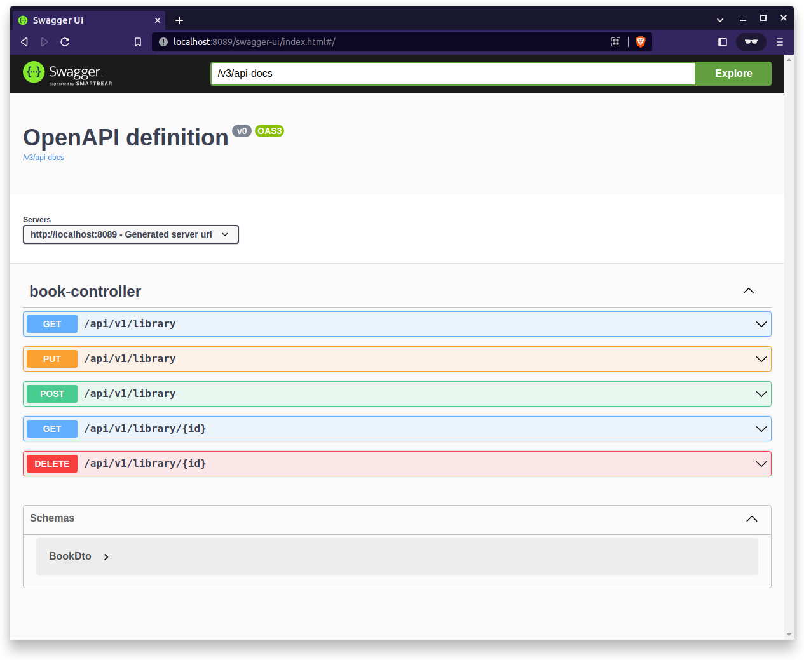

#### Exemplo2 - alterar controller da aplicacao, visualizar swagger alterado

1. versao original do controller
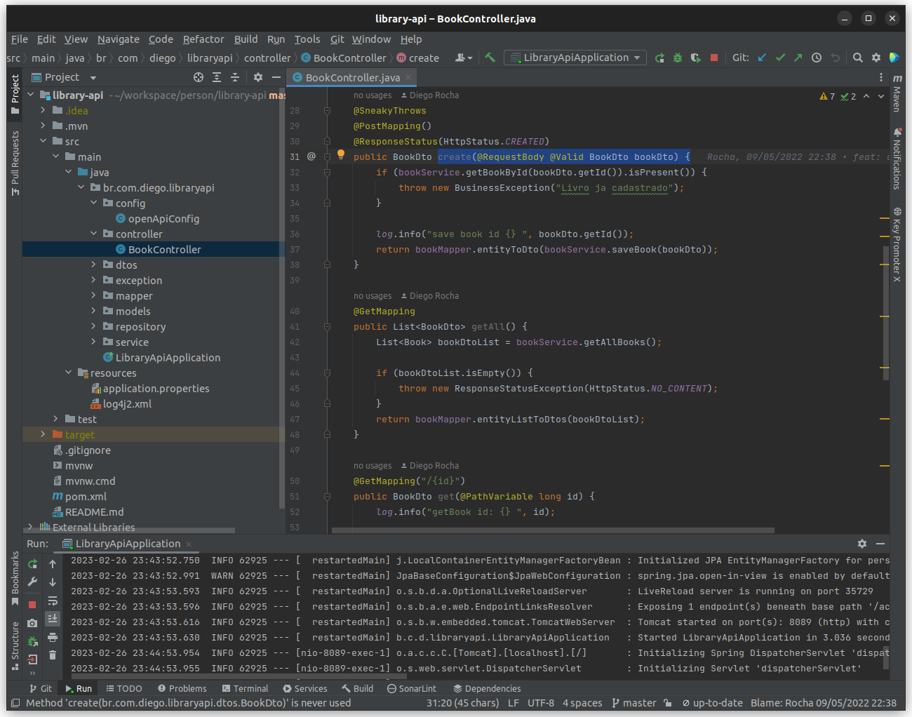

observe que so temos um edpoint de criar livro

```java
    @SneakyThrows
    @PostMapping()
    @ResponseStatus(HttpStatus.CREATED)
    public BookDto create(@RequestBody @Valid BookDto bookDto) {
        if (bookService.getBookById(bookDto.getId()).isPresent()) {
            throw new BusinessException("Livro ja cadastrado");
        }

        log.info("save book id {} ", bookDto.getId());
        return bookMapper.entityToDto(bookService.saveBook(bookDto));
    }
```

2. simular alteracao controller
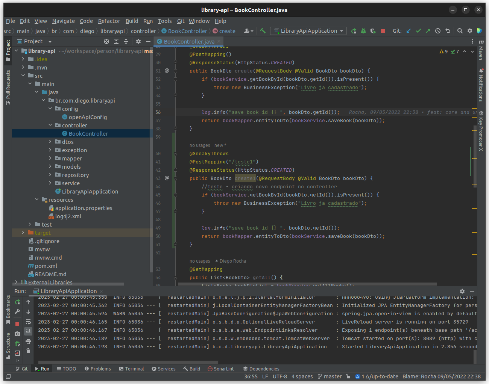

endpoint adicionado (novo cadastro de livro com outro path `/teste1`)

```java
    @SneakyThrows
    @PostMapping("/teste1")
    @ResponseStatus(HttpStatus.CREATED)
    public BookDto create1(@RequestBody @Valid BookDto bookDto) {
        //teste - criando novo endpoint no controller
        if (bookService.getBookById(bookDto.getId()).isPresent()) {
            throw new BusinessException("Livro ja cadastrado");
        }

        log.info("save book id {} ", bookDto.getId());
        return bookMapper.entityToDto(bookService.saveBook(bookDto));
    }
```

3. subir novamente a aplicacao

4. visualizar swagger
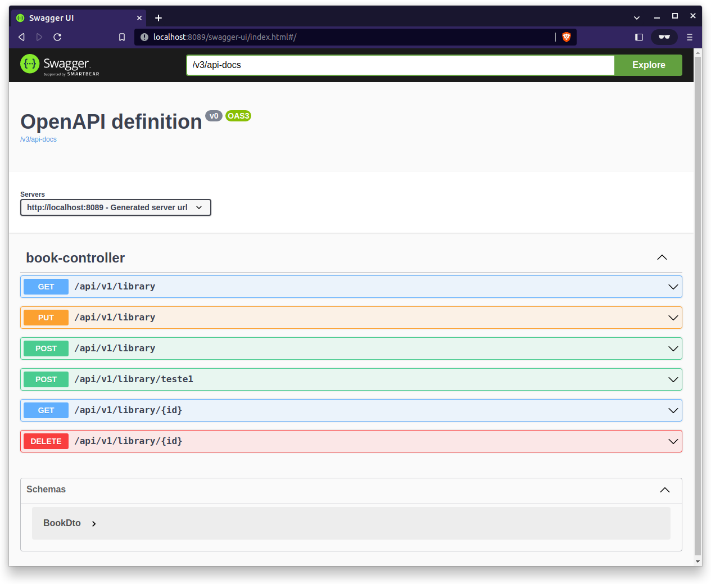

agora temos novo endpoint para criar livros, criado para exemplificar `/api/v1/library/teste1`

### HealCheck / Actuator

#### como configurar ele no projeto

1. dependencia maven

```xml
	<dependency>
		<groupId>org.springframework.boot</groupId>
		<artifactId>spring-boot-starter-actuator</artifactId>
	</dependency>
```

2. subindo aplicacao
3. bater endpoint Actuator

- <http://localhost:8089/actuator>

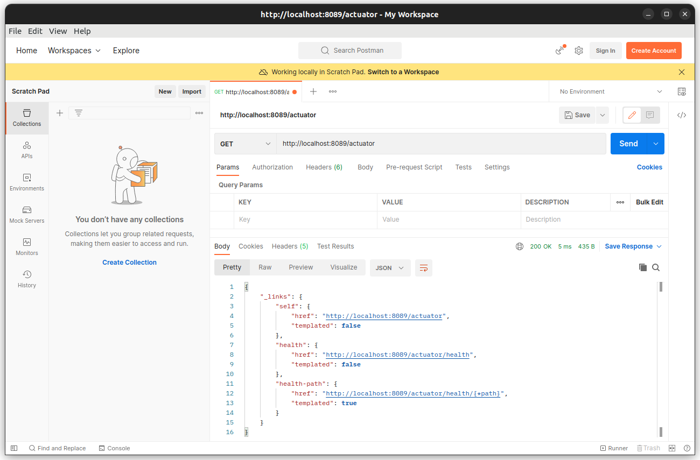

1. bater endpoint HealCheck

- <http://localhost:8089/actuator/health>

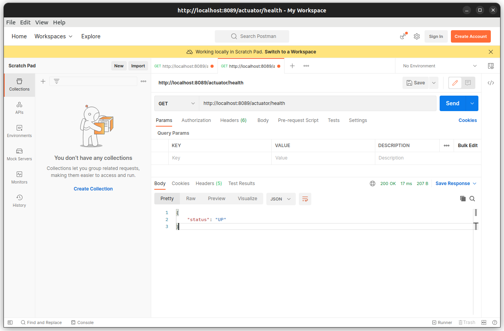

## Comunicao de sistemas

Tudo que temos em sites, comunicacao de sistemas, interacao entre sistemas se baseiam em envio e retorno de informacoes, exemplo click botao em uma loja
//TODO IMAGEM

### Tipos Comunicacao

#### Sincrono

//TODO

#### Assincrono

//TODO

### Rest

//TODO

### Fila

#### Fila - Simple Queue Service (SQS)

O Amazon Simple Queue Service (SQS) permite a comunicação entre dois sistemas de modo assíncrono, envio uma mensagem para um local (fila), a primeira mensagem que chegar é a primeira mensagem a sair e ele pode armazenar um alto volume de mensagens e ficar disponível para que outro projeto possa ler a processa-la quando necessário.

Observação1: vale salientar que o primeiro projeto que ler a mensagem (texto) contido nesta fila ele irá limpá-la (não ficando mais disponível para outra pessoa / projeto lê-la). Caso tenha dois projetos lendo a fila, apenas um será capaz de captura.

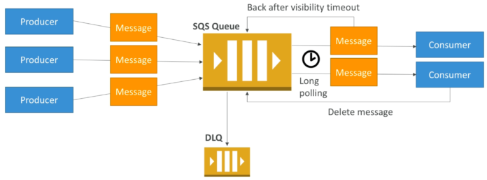

<https://funnelgarden.com/amazon-simple-queue-service-sqs-intro/>. Acessado em 12/10/2021 as 17:00

Observação2: No exemplo acima, além de ter a `QS Queue` também temos uma outra fila com nome relativamente estranho ‘DLQ’, para entendermos por que ela está ali vamos ver o cenário abaixo: 

Projeto `Producer` enviou da mensagem1 para a `SQS Queue` e o projeto ‘Consumer’ que leu a mensagem demorou 90 segundos para processar, dependendo como configuramos a nossa fila a mensagem pode:

- voltar para a fila principal `SQS Queue`
- ser enviado para outra fila, no caso ali é a fila `DLQ`

Nesse momento ficamos pensando, tínhamos a mensagem1 e o projeto `Consumer` leu o conteúdo dela. Daí fazemos a pergunta, por que ela volta para a fila? Porque o SQS tem um conceito padrão, que se mensagem consumida não for processada em menos de ’40 segundos’ ela voltará a fila de origem. Parece um pouco contraditório mais é legal saber dessa exceção. Um exemplo prático aqui é:

- Subimos um projeto local e está lendo a mensagem do SQS, porém nossa aplicação está em modo debug (com pontos de parada), vamos analisando o que ele está fazend no detalhe e demoramos 3 minutos, dai chegou a mensagem novamente e nos perguntamos: Como isso pode acontecido?
- A mensagem voltou a fila por estourou o tempo padrão que citamos acima (dos 40 segundos), algo muito comum de acontecer.

#### Fila - IBM MQ

//TODO

## Outros

### Redis

//TODO

### Amazon Simple Storage Service (Aws S3)

Amazon Simple Storage Service (Amazon S3) é um serviço de armazenamento de arquivos que existe na aws da amazon e podemos criar pastas / diretórios e armazenar arquivos dentro dessas sub-pastas
<https://aws.amazon.com/pt/s3/>

### Amazon Simple Email Service (Aws SES)

Amazon Simple Email Service é o mesmo que a sigla (SES), algumas empresas usam ele para envio e cadastro de e-mail para cadastro.
<https://aws.amazon.com/pt/ses/>

# Conceitos de Qualidade / QA

## Teste Manual

Ele é importante para nos ambientar com o que vai ser testado, e termos noção o que ira ser testado na demanda (visão) e o próximo passo automatizarmos os testes que são ‘chave’ cruciais para a demanda ou alto risco, conforma a necessidade da empresa / contexto.

E é importante conhecermos os princípios / conceito das coisas que vamos usar, para depois começarmos pensar em automatizar ou vamos demorar muito a entrega ou não testar algo por falta de visão, conhecimento. 

Como exemplo um cenário que vamos falhar se formos direto para automação, sem saber os conceitos. Certo dia um analista de teste está começando na área (primeiro emprego) e o chefe fala: cria um teste automatizado da API XPTO, porém como o QA não tem o conhecimento dos itens abaixo:

1. Postman

Recursos API

- Verbos / Metodos GET, POST, PUT, DELETE
- Url: link para validar a api, como ela é montada
- Porta: caso for o caso, ele iria no link da url (item citado acima)
- Params:
- Headers
  - Content-Type: Json (...)
  - Content-Type: File
  - Token
  - Authorization
- Body – e seus tipos de envio
- Response:
  - CodeStatus (e suas variações - 200, 201, 204, 400, 401, 404, 500, 504)
  - Body retornado
- Json: envio ou retorno da requisição

Se não conhecemos os conceitos acima, e ainda entender realmente como é o funcionamento vamos entrar em um dos dois cenários hipotéticos: atrasar a demanda / entrega ou não entregar o item com a cobertura necessária por falta de visão / conhecimento. Vale ressaltar que nem entrei em nível de código / desenvolvimento dos testes:

Configuração computador

- Instalação Java, IDE,
- Configurar variáveis de ambiente / Maven
- Maven Install ou Maven Clean Install (verificar se não tem nenhum erro / baixar as dependências contidas no pom)

Testes postman

- Entender todo processo de criar o resquest no postman
- Preencher campos necessários
- Variaveis de ambiente
- Validar resultados

Criar projeto de teste:

- pom, spring, dependências
- configurar recursos (REST Assured)
- criar request Token
- Criar requests do Crud (Post, Get, Delete, Update)
- Criar cenários de testes
- Criar massa de dados com uso DTO / JSON (factory) ou criar como String (caso não soubermos o outro modo, colando o json direamente...)
- Validar resultados e asserts

No cenário acima levamos acima, sem conhecer o processo, levamos em média 40 a 80h para criar uma automação simples de api rest (apenas chamar os verbos e validações básicas) e ainda deve faltar alguns cenários quando o QA for falar com o desenvolvedor.

- Podemos entrar um sistema com bugs ou problemas por falta ou visao de alguns testes

## Cenários de testes

Quando pegamos a documentação ou mesmo os cenários de testes do P.O. pensamos, agora só executar esses cenários que o P.O. visualizo e nosso trabalho está garantido?

> Versão com tradução livre (abaixo)

``
"Devemos apreender muito sobre o projeto que vamos testar. Em particular para descobrir erros, necessitamos apreender como os desenvolvedores acham os erros. E a especificação fala como o desenvolvedor trabalhou para criar o código de modo correto.
Eles não falam quais erros para nos anteciparmos, e nem como criar testes para encontrá-los. Aqui a chave, ou ponto chave, nos devemos conhecer melhor o projeto do início ao fim, todo o projeto.
Não importa o que pareça de fora, sempre que estamos testando com nossos cérebros engajados, nosso trabalho é exploratório."
`` Citação do livro “BACK, 2001”

> Versão original (abaixo)

``
"we will still learn a lot about how to test the product while we are testing it. In particular, as we discover errors, we learn how this group of programmers can go wrong. The specifications tell us about how the program is supposed to work when it is coded correctly.
They don't tell us what mistakes to anticipate, nor how to design tests to find them. At that task, our key task, we get better from the start to the end of the project, on every project.
No matter what it looks like from the outside, whenever we are testing with our brains engaged, our work is exploratory".
`` Citação do livro “BACK, 2001”

> BACK, James  Lessons Learned in Software Testing A Context-Driven Approach. 2001 - Editora : John Wiley & Sons


Após meditar sobre os pontos citados acima, começamos a tentar ver o nosso lado, na demanda apenas cobrir os cenários básicos que o P.O. (Product Owner) criou, que são relevantes, se testarmos ele não necessariamente a aplicação estará muito bem testada (se fosse apenas isso criaríamos apenas esse cenários e era só subir para produção sem problemas sempre). Parar termos uma visão mais ampla, necessitamos conhecer: projeto, empresa, arquitetura, desenvolvimento, camadas (front, back, middleware) e ter um pouco de visão do usuário final (quando necessário). Se termos esses conhecimentos / visões e os refletir sobre:

- O que fazer para quebrar o sistema
- Quais cenários extras devemos criar, relevantes ao negócio
- Análise de risco, áreas mais críticas sistema (se quebrarem podem parar a operação)
- O que o DEV ou PO não pensou
- Fazer reunião com o time, para levantar: riscos, preocupações e podemos pensar juntos no cenários mais críticos que devem ser testados e em qual camada cobrir

Para nos ajudar a elencar os testes vamos citar algumas técnicas de testes que iria nos ajudar (além de tudo que conhecemos (experiência, vivência projetos, conhecimento adquirido).

Porque precisamos entender e usar as tecnicas para extrair testes? Vou citar um exemplo comum de acontecer:

1. **Usar apenas o conhecimento / vivencia:**

Vamos entrair uns 10 testes, as vezes nao cobre nem uns 20% dos testes, os testes com maior risco de acontecer nem nos atentamos (deixamos de fazer), podemos levar bugs para producao pois so criamos cenarios basico:

- Cenario sucesso 201
- Nao retornar dados da base de dados
- Cenario insucesso 400, faltando um campo obrigatorio

1. **Usar técnica de POISED:**

Aqui vamos ver quais os cenarios mais criticos de uma api com base em tecnicas, que nos ajudam a extrair os cenarios mais criticos, que mais dao problema em uma api:

**Parametros** (campos enviados na requisicao / corpo):

- Campos do body em branco
- Campos do body null
- Campos do body tipos invalidos (null, int, string, bollean, null, empty)
- Campos obrigatorios informados
- Campos obrigatorios nao informados

**Saidas** (validar retorno):

- Cenario valido: validar json retornado
- Cenario valido: validar nome dos campos
- Cenario valido: validar status code retornado (esta condinzendo con o teste)
- Cenario invalido, validar body retornado
- Cenario invalido, validar statusCode retornado (400, 404, 500)
- Cenario invalido, mensagens do erro

**Interoperabilidade**  (comunicacao do sistema)

- Digitarmos valores validos, sistema retornar sucesso e como esperado

**Seguranca:**

- Token valido
- Token invalido
- Token de outra pessoa
- Sem informar o token (nao poderia retornar dados)
- Envio scripts dentro de campos
- Envio caracteress especias, astericos ou outros, para validar se o sistema se comporta realmente da erro e nao retorna dados sensiveis do banco de dados

**Erros:**

- Validar excessoes na aplicacao
- Tentar achar erros 500 na api, por erros em campos / sem informar ou invalidos
- Tentar deletar um registro duas vezes, ver qual codigo de erro ocorre / retorna na segunda vez
- Validar um campo com formato invalido, validar codigo e mensagem de retorno

**Data** (validar dados criados / retornados):

- Criar um teste POST, criar recurso
  - validar dados enviados versus retornados no response
  - Fazer chamada GET por id, validar dados retornados

1. Agora fica mais claro, como uma técnica pode nos ajudar em extrair testes, visa-o mais amplas e decidir junto com o time, quais os testes mais críticos e em qual camada cria-los (unit, integrados..).

## Técnicas de Testes – Tabela de Decisão

Ela nos ajuda a extrair testes de documentação / requisitos

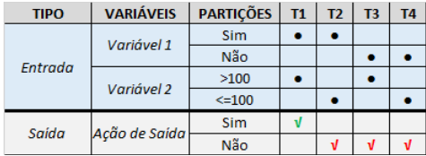

Imagem extraida do artigo: <https://medium.com/revista-tspi/a-t%C3%A9cnica-de-tabela-de-decis%C3%A3o-no-mundo-dos-testes-29d3a332473c>, acessado em 14/10/2021 as 19:00

Quintas na Prática: Criando Tabelas de Decisão com x|decision -> <https://youtu.be/3wtavNon34A>
Ferramenta xdecision: juliodelima.com.br/xdecision

## Técnicas de Testes – Partição de Equivalência

Este tipo de técnica nos ajuda a ter visão de que testes, quais cenários criar quando temos uma regra de negócio com números, como exemplo: pode tirar carteira de motorista

- Maior 16 anos: pode tirar carta de motorista com autorização pais
- Maior 18 anos: pode tirar carteira de motorista

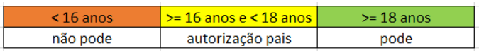

Com isso iremos testar esses três blocos e validar se as regras foram aplicadas como deveria.
<https://medium.com/revista-tspi/t%C3%A9cnica-de-teste-particionamento-de-equival%C3%AAncia-d32a7d689d82>

O que é Partição de Equivalência: O Guia Definitivo -> <https://www.youtube.com/watch?v=-IdzE1GoC-g>

Vale salientear que muitos erros / bugs ocorrem em boundary / limites que e a particao de equivalencia, sempre bom testa-los, como cita o Mauricio Aniche no livro - Effective Software Testing.

## Técnica POISED – testes de api

<https://testautomationu.applitools.com/exploring-service-apis-through-test-automation/chapter3.0.html>

### aplicando tecnica


1. **Usar técnica de POISED:**

Aqui vamos ver quais os cenarios mais criticos de uma api com base em tecnicas, que nos ajudam a extrair os cenarios mais criticos, que mais dao problema em uma api:

**Parametros** (campos enviados na requisicao / corpo):

- Campos do body em branco
- Campos do body null
- Campos do body tipos invalidos (null, int, string, bollean, null, empty)
- Campos obrigatorios informados
- Campos obrigatorios nao informados

**Saidas** (validar retorno):

- Cenario valido: validar json retornado
- Cenario valido: validar nome dos campos
- Cenario valido: validar status code retornado (esta condinzendo con o teste)
- Cenario invalido, validar body retornado
- Cenario invalido, validar statusCode retornado (400, 404, 500)
- Cenario invalido, mensagens do erro

**Interoperabilidade**  (comunicacao do sistema)

- Digitarmos valores validos, sistema retornar sucesso e como esperado

**Seguranca:**

- Token valido
- Token invalido
- Token de outra pessoa
- Sem informar o token (nao poderia retornar dados)
- Envio scripts dentro de campos
- Envio caracteress especias, astericos ou outros, para validar se o sistema se comporta realmente da erro e nao retorna dados sensiveis do banco de dados

**Erros:**

- Validar excessoes na aplicacao
- Tentar achar erros 500 na api, por erros em campos / sem informar ou invalidos
- Tentar deletar um registro duas vezes, ver qual codigo de erro ocorre / retorna na segunda vez
- Validar um campo com formato invalido, validar codigo e mensagem de retorno

**Data** (validar dados criados / retornados):

- Criar um teste POST, criar recurso
  - validar dados enviados versus retornados no response
  - Fazer chamada GET por id, validar dados retornados

## Técnica VADER

<https://medium.com/revista-tspi/chama-o-darth-vader-para-te-ajudar-a-testar-as-apis-4fafc5846b32>

## Como está a cobertura da sua API?

Um tema que poucos comentam, porém extremamente relevante. Se apenas pegarmos a API para automatizar e criar nossos testes caso não conhecemos a fundo as técnicas de testes citadas acima (POISED, VADER), não teremos uma grande cobertura por falta de visão, e no caso de api podemos ter defeitos na comunicação com outros serviços e as vezes algum bug em produção por não cobrirmos algum item.

<https://medium.com/revista-dtar/como-verificar-a-cobertura-de-testes-da-api-rest-9e2f745564b>

## Flaky Tests

Termo comumente usando quando temos um teste em uma release, pipeline e ao executarmos o testes várias vezes, hora passa e outros momentos falha, isso sem mudar o código fonte da aplicação. 
Em casos como esse, precisamos investigar a causa raiz do problema que está sendo gerado ou código mal feito / configurado, porque se rodamos o teste 10 vezes sem mudança do código da aplicação o mesmo deveria sempre passar, neste cenário perdemos a confiança no teste, por isso é necessário achar sua causa raiz que pode ser:

- Acesso
- Intermitência de alguma aplicação
- Massa de dados alterada
- Acesso de uma api, na chamada de outra api
- Falta de mocky
- Ambiente
- Load balance que hora joga a requisição para uma máquina boa, e alguns momentos joga para uma máquina que esteja com problema
- Rede
- Dentre outros problemas.
Isso é algo pouco falado, porém importante sabermos que ele existe, e caso acharmos, investiga-lo.

## Tipos de Testes

### Unitários

- Java: Junit
- Js: jasmine, karma, jest

### Teste jsonschema

//TODO

### Teste contrato

- Testes Pact
- Testes Contrato CDC spring

### Teste Integrado

- Rest assurance
- Testes api (get, post, delete, put)
- Testes health check

### Teste Sistema / e2e

- Realizamos em aplicacoes web no navegador

Framewoks

- Selenium + Java
- cypress
- python + robot

#### Pontos estudar

- Como capturar elementos
- Page Objets: boas práticas
- Quais tipos de testes podemos colocar nessa camada

### Teste Performance

- Jmeter, K6
- Jmeter + Blazemeter, Gatling, Locust, k6, Artillery
- <https://testguild.com/load-testing-tools/>

### Teste Mobile

- Appium - java, python...
- DeviceFarm

## Frameworks

- Junit
- Asserj
  - tupple + lista
- jest, jastmine, karma

## Ferramentas

### Postman

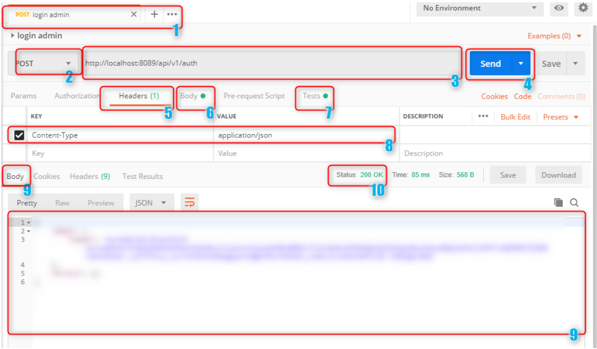

1. Abas de navegação 
2. Verbo HTTP: ele pode mudar conforme o tipo de requisição a ser usada, as mais comum usadas são: POST, DELETE, PUT, GET
3. URL: é o caminho completo que usamos na aplicação, neste caso costuma ter no Controller da aplicação (porém precisa ser ser montado)
4. Send: botão envio da requisição
5. Headers: nesta aba conseguimos passar os parâmetros de cabeçalho (itens mínimos da requisição)
6. Body:
7. Tests: nele conseguimos usar um código fonte para poder extrair o token e deixar na memória (Environment) para usar na próxima requisição, exemplo abaixo:

```json
var jsonData = JSON.parse(responseBody);
postman.setEnvironmentVariable("token", jsonData.token);
```

8. Aqui informamos ‘key’ (chave) e ‘value’ (valor) ao lado, nesse caso passamos os campos obrigatórios de cabeçalho da requisição, exemplo:
a. Content-Type: application/json
b. Authorization: token em forma de texto
9. Body:
- nesta aba de exibido o texto do retorno requisição / chamada
- Texto retornado
10. HTTP Status Codes (valor do retorno da requisição), pode ser: 200, 201, 400, 404, 500...

- Postman POST
- Postman GET ONE
- Postman GET TALL
- Postman DELETE
- Postman PUT

### Swagger

- Swagger POST
- Swagger GET ONE
- Swagger GET TALL
- Swagger DELETE
- Swagger PUT

## Topicos avancados

### Pipeline

- build aplicacao
- execucao testes
  - diversos niveis de testes
- analise estatica
- validacao versao
- validacao branch
- Validacao Seguranca

### Camadas de execucao dos Testes

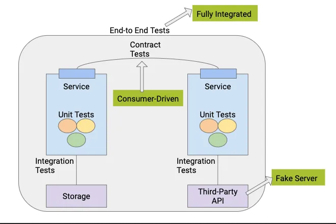

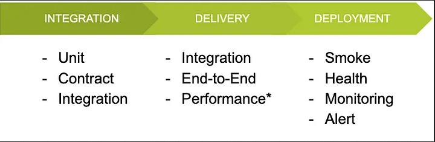

créditos imagem: <https://medium.com/assertqualityassurance/abordagem-de-testes-212b6238f0c3>

### Importancia / Porque ter uma pipeline

- Ferramentas
- Azure Devops
- Jenkins
- git actions
- git lab
- Docker / Container - Execucao testes no docker local

## Análise estatica

- Complexidade ciclomatica
- Sonar local
- Importancia de codigo limpo

## SeleniumGrid

- DockerFile
- Execucao testes
- Execucao testes em paralelo

# CONCLUSÃO

Porque demos conhecer tudo que está nesse ebook? Para sermos um professional mais qualificado e como falam em alguns livros / locais:

- Se entregarmos o básico (apenas testo a aplicacao) ou não conhecer as coisas com profundidade não conseguimos achar defeitos que muitas vezes estão em camadas acima ou coisas que não temos visão, itens citados no aqui é o básico que devemos fazer para desempenhar nosso papel acima da curva e evitarmos ficar travados em atividades simples do dia a dia (esperando o desenvolvedor para subir a aplicação local, debug ou analisar o problema que esta sendo gerado em um teste que pode-se ter muitas origens).

Com o conhecimento adquirido aqui, veja o que for mais relevante ao seu trabalho e se aprofunde no que for mais necessário / conveniente para entregar um trabalho com mais qualidade e poder ajudar o time nas atividades (cada vez mais ir imergindo em outro locais e trazendo o time para lher ajudar nas atividades de QA, que são muitas).

Vale lembrar que: não devemos nos limitar apenas nos conhecimentos mostrados aqui, busque mais conhecimento e visão das coisas com que trabalha.

# REFERENCIAS

- Aplicação que foi usada nos prints:
  - Como construir sua própria aplicação api rest com java: <https://medium.com/assertqualityassurance/como-construir-e-testar-uma-api-em-java-utilizando-o-postman-baae69d8b8aa>
  - Código fonte da  aplicação: <https://github.com/AntonioMontanha/gerenciador-viagens>
  - **Creditos**: Julio de Lima e Antonio Montanha
- BACK, James  Lessons Learned in Software Testing A Context-Driven Approach. 2001  - Editora: John Wiley & Sons. <https://www.amazon.com/Lessons-Learned-Software-Testing-Context-Driven/dp/0471081124>

# RECOMENDAÇÕES

## LIVROS

- Ebook sobre api-rest (básico), “ebook-s > Testes de API Rest”: <http://www.juliodelima.com.br/>
- Ebook testes api (mostra conceitos, subir aplicação local, postman e automação) <https://leanpub.com/api-testing-postman-rest-assured-v1>
- Spring Boot Da API REST aos Microservices <https://www.michellibrito.com/>
- Effective Software Testing - Mauricio Aniche <https://www.amazon.com.br/Effective-Software-Testing-Developers-Guide/dp/1633439933>
- Deploy em produção para desenvolvedores (com participação da Samanta Cecilia) <https://leanpub.com/deployemprodparadevs>
- Testes Automatizados de Software: Um Guia Prático - (introdução e exemplos de automação): <https://www.casadocodigo.com.br/products/livro-testes-de-software>
- Software Engineering at Google: Lessons Learned from Programming Over Time
Edição Inglês - Titus Winters, Tom Manshreck, Hyrum Wright <https://www.amazon.com.br/Software-Engineering-Google-Titus-Winters/dp/1492082791>

**livros recomendados pela Samanta Cecilia**

- <https://github.com/pagarme/biblioteca-virtual>

**Livros recomendados pelo Elias Nogueira**

- <https://www.linkedin.com/posts/eliasnogueira_3-technical-testing-books-to-improve-your-activity-6699661487327203330-A1PG/>

**Livros recomendados pelo Vinicius Personi**
<https://viniciuspessoni.com/category/livros-sugeridos/>

## CURSOS

- TAU: <https://testautomationu.applitools.com/>
  - POISED: <https://testautomationu.applitools.com/exploring-service-apis-through-test-automation/>
- Api-rest: <https://www.udemy.com/course/testando-api-rest-com-rest-assured/>
- Junit: <https://www.udemy.com/course/junit-para-testadores/>

## ARTIGOS

- Testópsia: Dissecando seus testes - Marlon Almeida: <https://medium.com/revista-tspi/test%C3%B3psia-dissecando-seus-testes-9990bbc73e96>
- QA, não tenha medo do backend! - Diego Rocha: <https://medium.com/revista-tspi/qa-n%C3%A3o-tenha-medo-do-backend-e4830da2eefc>
- Testes Baseados em Riscos (Risk-Based Testing) - Gabriel Santos: <https://medium.com/revista-tspi/testes-baseados-em-riscos-risk-based-testing-b7dfa751ec17>
- Como construir e testar uma API em Java utilizando o Postman <https://medium.com/assertqualityassurance/como-construir-e-testar-uma-api-em-java-utilizando-o-postman-baae69d8b8aa>
- Mapa de Levels de Test Engineer - (Artigo fantastico, vale muito ler)
<https://medium.com/stonetech/mapa-de-levels-de-test-engineer-da9c46ff59b7>
- Mapa de Levels de Test Engineer - Samanta Cicilia <https://medium.com/stonetech/mapa-de-levels-de-test-engineer-da9c46ff59b7>
- Abordagem de testes - Samanta Cicilia - <https://medium.com/assertqualityassurance/abordagem-de-testes-212b6238f0c3>

## Patterns para QA

- <https://www.linkedin.com/pulse/design-patterns-test-automation-i-alex-ilyenko/>
- <https://alexilyenko.github.io/patterns-1/>
- <https://alexilyenko.github.io/patterns-2>
- <https://alexilyenko.github.io/patterns-3>

## Sites com api’s para estudo

Da para subir aplicação local e usarmos para estudar:

- Api: <https://github.com/ServeRest/ServeRest>
<https://serverest.dev/>

## Guia estudo QA

- <https://github.com/samycici/qa-studyguide>
- <https://github.com/pagarme/biblioteca-virtual/blob/main/conteudos/QUALIDADE.md#computer-automa%C3%A7%C3%A3o-de-testes>
- <https://github.com/pagarme/cafe-com-testes>

## MELHORES VIDEOS E PALESTRAS

- Michelle Brito - Spring: <https://www.youtube.com/watch?v=LXRU-Z36GEU>
- Modern Testing Patterns  -> <https://tomcools.be/talks/jfokus2022/>
- API Testing following the Test Pyramid (Elias Nogueira, Netherlands) ->  <https://youtu.be/vRl2oO7hCFY>
- Alura Star, QA sênior e deficiente auditivo: Paulo Gonçalves -> <https://youtu.be/d6Jdytw_BhI>
- Roadmap QA - Aguiar Dev Talks #24 -> <https://youtu.be/irIHzYtWl7E> (34 a 41min)
- Vinicius Personi - 6 Dicas Para Ter Mais Visibilidade No Seu Trabalho E Se Destacar -> youtube

# SOBRE AUTOR

Diego de Medeiros Rocha – QA desde 2011, atuando todo período com automação de testes e com o tempo foi criando mais paixão por: testes, desenvolvimento e arquitetura. E sempre estudando para tentar ser um profissional melhor e ajudar o time.

- Engenheiro de Qualidade na [Kstack - Alelo Frota];
- **Atuando em time de plataforma:**
  - Automação
  - Pipeline
  - Mentorias
  - Prover soluções para times:
    - Backend, Frontend
    - Migração do frontend para microfrontend
    - Vários níveis de testes
    - Ajudar QAs e empresa com problemas e soluções
    - Criação do processo de qualidade para o time de DataLake:
      - análise projeto / codigo fonte, criando padrão de testes, pipeline (execucao testes, build, validações)

**Informações**

- Aluno TSPI, DTAR - Julio de Lima;
- Ajudar empresas a entregarem software com mais qualidade;
- Mentorar ou ajudar pessoas a melhorarem seus skills e conhecimentos;
- Ensinar sobre: testes, desenvolvimento;
- Ajudar o time com desenvolvimento, testes, problemas ou busca de soluções;
- Estudar sobre testes, desenvolvimento, devops.

**Contato**

- Linkedin: <https://www.linkedin.com/in/diego-rocha/>
- Github: <https://github.com/diegomedeirosrocha>
- Medium:  <https://medium.com/revista-dtar/qa-analisar-ou-n%C3%A3o-log-c%C3%B3digo-ao-realizar-os-testes-2dd3d2b03b0d>
Infos adicionais
- Palestra DTAR: <https://www.youtube.com/watch?v=cDBewH3JBn8>
- Coautor livro Jornada Java: <https://www.amazon.com.br/Jornada-Java-constru%C3%A7%C3%A3o-implanta%C3%A7%C3%A3o-Colaborativa-ebook/dp/B091D8SVTN>

# Achou conteúdo importante, revelante ou apreendeu algo?

- Envie a uma amigo que esteja precisando
- Compartilhe
- Deixe uma estrela se gostou do conteudo ;)

# Informativo

- Esqueci de dar créditos para alguém ou fazer citação?
  - Me mandem mensagem privada no linkedin por favor, terei o prazer de alterar e dar os devidos créditos.
